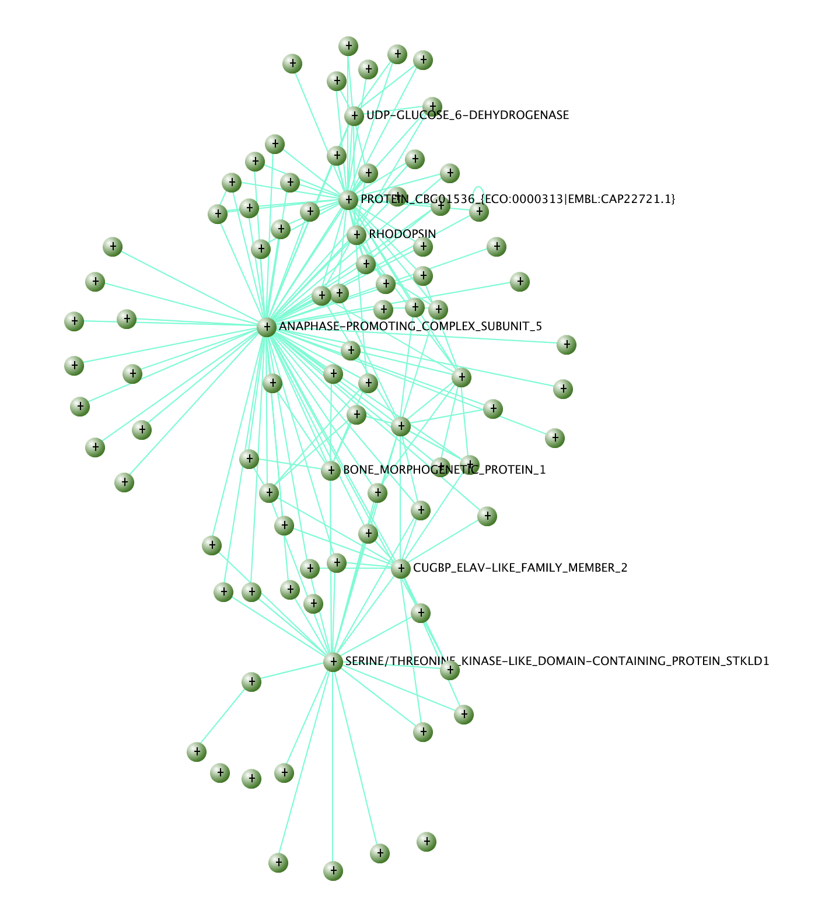

```{r setup, include=FALSE}
knitr::opts_chunk$set(echo = TRUE)
```

## WGCNA tutorial for Sprialbase VLM 11/18/21

This tutorial is intented to be a basic introduction to using WGCNA for RNAseq datasets. For this we will use transcriptomic data from the startlet sea anemone *Nematostella vectnensis* spanning the first seven days of development [(Warner et al. 2018)](https://pubmed.ncbi.nlm.nih.gov/29739837/). This is not an ideal dataset, the sampling is sparse, every 24 hours for 7 days in duplicate. This sampling is more typical of a first approach used by embryologists to characterize and emerging model system. An ideal sampling design would be a very dense sampling of a discrete biological process (e.g. the timepoints surrounging a morphogenetic event). In any experimental design, WGCNA performs best with 16 samples or more. Fewer than this and identifying modules becomes very challenging.

First let's read in the data.These data have already been quantified against a transcriptome using bowtie2 and RSEM, normalized with EdgeR, and each transcript count was summed in term of each gene model from the draft genome. The only transformation we will do here is a log2 transform.

```{r message=FALSE, warning=FALSE}
warner_data <- read.table(url("https://raw.githubusercontent.com/ScientistJake/Spiralbase_VLM_tutorial/main/data/Warner_normalized_cpm.txt"), header = T, quote = "")
warner_data_Log2 = log(warner_data+1,2)
```

Next we will explore the data using a simple PCA. This will give us a general idea of the structure of our data.
```{r message=FALSE, warning=FALSE}
library(ggplot2)
library(tidyverse)

warner_rep <- factor(c(1,2,1,2,1,2,1,2,1,2,1,2,1,2,1,2))
warner_time <- factor(c("24hpa","24hpa","48hpa","48hpa","72hpa","72hpa","96hpa","96hpa","120hpa","120hpa","144hpa","144hpa","168hpa","168hpa","192hpa","192hpa"))

warner_PCA_data <- warner_data_Log2 %>%
  t() %>% #this puts samples as rows, genes as columns 
  as.data.frame() %>%
  prcomp() 

warner_scores_to_plot <- as.data.frame(warner_PCA_data$x) 
ggplot(data = warner_scores_to_plot, 
       aes(x = PC1, y = PC2, 
           label = rownames(warner_scores_to_plot), 
           colour=factor(warner_time),
           shape=factor(warner_rep)
           )
       ) + 
  geom_point(size=3) + 
  scale_fill_hue(l=40) + 
  coord_fixed(ratio=1, xlim=range(warner_scores_to_plot$PC1), ylim=range(warner_scores_to_plot$PC2)) 
```

In this plot we can see there's a lot of variation in the first two days (as is expected), while later at timepoints the transcriptomic differences become less pronounced. We'll keep this in mind since this means we will likely observe very large modules that correlate to 24hpf and 48hpf that will be difficult to tease out.

Let's proceed with WGCNA below. We're going to read in the data and again apply a log2 transformation. It is important NOT to filter the data by differential expression or variance beforehand. Doing so will result in a few very large modules that correlate to your filtering criteria. Don't worry, all of the low variance genes will fall into the background (grey module). The first step is to read in the data and choose the soft power. Soft-thresholding power is a key parameter in scale free networks such as WGCNA. When using timeseries data it's normal to not have an R^2 that exceeds 0.90. This is because time series data, or perturbation data for that matter, include strong drivers of variance. In these cases, and especially for datasets that span long timeseries, you can try choosing a soft power that crosses a lower threshold like 0.80 or pick a generic soft power [as outlined in faq 6 here](https://horvath.genetics.ucla.edu/html/CoexpressionNetwork/Rpackages/WGCNA/faq.html).

```{r message=FALSE, warning=FALSE}
rm(list = ls())
gc()
library(WGCNA)
library(tidyverse)

warner_WGNCA_data <- read.table(url("https://raw.githubusercontent.com/ScientistJake/Spiralbase_VLM_tutorial/main/data/Warner_normalized_cpm.txt"), header = T, quote = "") %>%
  mutate_all(function(x) log(x+1,2)) %>%
  t()

powers = c(c(1:10), seq(from = 12, to=40, by=2))
disableWGCNAThreads()
sft = pickSoftThreshold(warner_WGNCA_data, powerVector = powers, verbose = 5, networkType = "signed")

{cex1 = 0.9;
plot(sft$fitIndices[,1], -sign(sft$fitIndices[,3])*sft$fitIndices[,2],
     xlab="Soft Threshold (power)",ylab="Scale Free Topology Model Fit,signed R^2",type="n",
     main = paste("Scale independence"));
text(sft$fitIndices[,1], -sign(sft$fitIndices[,3])*sft$fitIndices[,2],
     labels=powers,cex=cex1,col="red");
  # this line corresponds to using an R^2 cut-off of h
abline(h=0.80,col="red")
plot(sft$fitIndices[,1], sft$fitIndices[,5],
     xlab="Soft Threshold (power)",ylab="Mean Connectivity", type="n",
     main = paste("Mean connectivity"))
text(sft$fitIndices[,1], sft$fitIndices[,5], labels=powers, cex=cex1,col="red")
}
```

You can see that the model fit plateus at around 20 so we'll start with this as our soft-thresholding power.

Let's move on to the construction of the adjacency matrix and generating the gene tree. The adjacency and overlap matrices are the crux of this algorithm. We use them to build a gene tree and then 'cut' the tree to identify modules similar to tree cutting when using hierarchical clustering. We can use the function `cuttreeHybrid` to perform adapting cutting based on branch length. The resultant modules are color coded below the tree. This function also allows splitting of branches to identify sub modules. So we have three sets of modules each with progressively more and finely split modules. Deep splitting can yield modules that are too redundant/ similar but also at times identify interesting sub networks. This part of the workflow is really easy so I recommend trying different splits and looking at the data.
```{r message=FALSE, warning=FALSE}
softPower = 20 # (Read WGCNA tutorial to learn how to pick your power)
rankExpr = rank(colMeans(warner_WGNCA_data))
rankConn = rank(softConnectivity((warner_WGNCA_data),type="signed",power=softPower)) 

enableWGCNAThreads()
library(flashClust)

adjacency = adjacency((warner_WGNCA_data),power=softPower,type="signed"); 
diag(adjacency)=0
Degree <- rowSums(adjacency)

Degree=Degree/max(Degree); gc()
dissTOM = 1-TOMsimilarity(adjacency, TOMType="signed") 
geneTree = flashClust(as.dist(dissTOM), method="average")

mColor=NULL
for (ds in 0:3){
  tree = cutreeHybrid(dendro = geneTree, pamStage=F, minClusterSize = (30-3*ds), deepSplit = ds, distM = dissTOM)
  mColor=cbind(mColor,labels2colors(tree$labels)); }

plotDendroAndColors(geneTree, mColor, paste("dpSplt =",0:3), main = "",dendroLabels=FALSE); 
```

Looking at this tree the first thing that pops out is the size of the branches and clusters which are very large. This is typical of embryonic timeseries data since there are massive differences between each timepoint. Here, I would recommend a deepsplit of 1 since there appears to be some subsctrucutre to the three branches in the middle and results in smaller modules as opposed to dewpsplit 0. As stated above, I would try this several ways. 

```{r message=FALSE, warning=FALSE}
#pick a module deep split
modules = mColor[,2]
dynamicColors= labels2colors(modules)

#print the module sizes
table(modules)
```

You can see from the results above that the modules are quite large but with the deeplsplit we can recover smaller more managable modules. `grey` is reserved for unassigned so a third of the genes here aren't in any module.

Next we'll extract [eigengenes](https://en.wiktionary.org/wiki/eigengene) which summarize the expression of each module. Here, we're only plotting the eigengenes for one module, 'cyan', but I included a commented section of code below that which will loop through the modules and save each plot into a directory. I also include the replicate information in my plots to see if one replicate is a significant driver of a particular module.
```{r message=FALSE, warning=FALSE}
PCs = moduleEigengenes((warner_WGNCA_data), colors=modules)
ME  = PCs$eigengenes
MEDiss= 1-cor(ME)
METree= flashClust(as.dist(MEDiss), method= "average")
MEs= orderMEs(ME)

plot(METree, main= "Clustering of module eigengenes", xlab= "", sub= "")

## optional merge
## run this if you have overly redundant modules

#MEDissThres= 0.15
#merge= mergeCloseModules(warner_WGNCA_data, modules, cutHeight= MEDissThres, verbose =3)
#mergedColors= merge$colors

library(reshape)
ME_plot <- as.data.frame(t(MEs))
colnames(ME_plot) = c(24,24,48,48,72,72,96,96,120,120,144,144,168,168,192,192)

library(ggplot2)
row.names(ME_plot) <- rownames(ME_plot)
ME_plotM <- melt(as.matrix(ME_plot), id.vars="row.names", value.name="value")

co = c("MEcyan")

ME_plot_color <- ME_plotM[ME_plotM$X1 == paste(co),]
  group <- c(1,2,1,2,1,2,1,2,1,2,1,2,1,2,1,2)
  
  p <-  ggplot(ME_plot_color, aes(x=as.numeric(as.character(ME_plot_color$X2)), y=value, colour=paste(co), group = group)) + 
    geom_line(size =1.5) +
    scale_x_continuous(minor_breaks = NULL, breaks=c(0,2,4,8,12,16,20,24,36,48,60,72,96,120,144)) +
    ylab("Eigengene expression") +
    xlab("Hours Post Fertilization")
  
  print(p)
  
# for(co in rownames(ME_plot)){
#   ME_plot_color <- ME_plotM[ME_plotM$X1 == paste(co),]
#   group <- c(1,2,3,1,2,3,1,2,3,1,2,3,1,2,3,1,2,3,1,2,3,1,2,3,1,2,3,1,2,3,1,2,3,1,2,3,1,2,3,1,2,3,1,2,3)
#   
#   p <-  ggplot(ME_plot_color, aes(x=as.numeric(as.character(ME_plot_color$X2)), y=value, colour=paste(co), group = group)) + 
#     geom_line(size =1.5) +
#     scale_x_continuous(minor_breaks = NULL, breaks=c(0,2,4,8,12,16,20,24,36,48,60,72,96,120,144)) +
#     ylab("Eigengene expression") +
#     xlab("Hours Post Fertilization")
#   
#   file = paste("plots/ME_", co, ".pdf", sep="")
#   pdf(file = file, width = 8, height = 6)
#   print(p)
#   dev.off()
# }
```
From the clustering we can see that our modules are fairly well separated. This kind of clustering also lets us gauge module similarity in the event we want to merge close modules or when we explore the data in more detail notice that certain modules are too similar. 

Next we can make a heatmap that correlates the modules with traits/ phenotypes/ geneotypes / whatever. In this dataset the only variable we have is time so that's what our correlation will be based on. This is where you would include data for knockdowns as well.

```{r message=FALSE, warning=FALSE}
traits <- read.table(url("https://raw.githubusercontent.com/ScientistJake/Spiralbase_VLM_tutorial/main/data/warner_traits.txt"), sep='\t', header=T, quote="",row.names=1)

nGenes = ncol(warner_WGNCA_data)
nSamples = nrow(warner_WGNCA_data)
moduleTraitCor = cor(ME, traits, use = "p");
moduleTraitPvalue = corPvalueStudent(moduleTraitCor, nSamples)

textMatrix = paste(signif(moduleTraitCor, 2), "\n(",signif(moduleTraitPvalue, 1), ")", sep = "");
dim(textMatrix) = dim(moduleTraitCor)
library('viridis')
library(RColorBrewer)
colors = colorRampPalette(rev(brewer.pal(n = 9, name ="RdYlBu")))(200)

labeledHeatmap(Matrix = moduleTraitCor,
  xLabels = c("24hpf","48hpf","72hpf","96hpf","120hpf","148hpf","168hpf","192hpf"),
  yLabels = names(ME),
  colorLabels = FALSE,
  colors = colors,
  textMatrix = textMatrix,
  setStdMargins = F,
  cex.text = 0.5,
  zlim = c(-1,1),
  verticalSeparator.x = 1:dim(moduleTraitCor)[2],
  verticalSeparator.col="grey80",
  horizontalSeparator.y = 1:dim(moduleTraitCor)[1],
  horizontalSeparator.col="grey80",
  main = paste("Module-hpf relationships")
  )
```

As you can see, most of our modules have a strong correlation/ anti-correlation with the first time point. This is to be expected as it is the most distinct in terms of gene expression. We do observe some other interesting modules however like those that correlate to 48hpf or the later developmental timepoints.

This is usually a good place to stop, bind your module assignments to a count table / annotation table and look through your data in detail. Then go back and choose different parameters (e.g. a deeper split, or module merging) until the data makes the most sense to your trained biologist eye. Below is a few lines of code that will do that. Remember that the module vector is in the same order as the original count data so you can bind it directly to the count table and it will be correct. Below I read in the original counts, merge the annotations (keeping the order of the count table), and add the module assignment vector.

```{r include=FALSE,message=FALSE, warning=FALSE }

annotations = read.table(url("https://raw.githubusercontent.com/ScientistJake/Spiralbase_VLM_tutorial/main/data/Nemve1_annotated_uprotnames.txt"), sep='\t', header=T, quote="")
warner_data <- read.table(url("https://raw.githubusercontent.com/ScientistJake/Spiralbase_VLM_tutorial/main/data/Warner_normalized_cpm.txt"), header = T, quote = "")

master = merge(warner_data,annotations, by.x='row.names',by.y='ContigName', all.x=T)
master$module = modules
#if merging was performed
#master$module_merged = mergedColors
#write.table(master,file="data/master_annotations.txt", sep='\t',row.names = F,quote=F)
```

If our modules are discrete enough, we can calculate the intra-module connectivity of each gene. This will allow us to identify hub genes aka genes with high connectivity to many other genes within a module. In theory, these genes are important to the function of the module as a whole. In application this theory typically holds up rather well with hub genes representing key markers / differentiation factors / gene products that are activated in a cell under certain conditions *assuming that your modules are not too large and correlate to discrete biological events*. 

In datasets like this one, it is futile to try and identify hub genes for the large modules. There will simply be too many genes with very high connectivity. So if you are most interested in the modules activated at 24hpf I would recommend resampling at a tighter time interval around this timepoint. Here, we'll exam the cyan module since it is relatively small and has an interesting expression pattern peaking at 48hpf. Below is some code that will export the connectivity data in a format that is directly accepted by [visant](http://www.visantnet.org/visantnet.html). This will make two tables, one that includes connections over a connection strength of 0.05 to exlcude weak connections and another that includes just the top 250 genes. You can modify these or add additional exports with different cutoffs if your lists are too small/large.  I also included a commented code set to loop this and export tables for all modules. 

```{r message=FALSE, warning=FALSE}
# go for visant
TOM = TOMsimilarity(adjacency, TOMType="signed") 

#we need some annotations otherwise we'll be looking at useless gene IDs
annotations = read.table(url("https://raw.githubusercontent.com/ScientistJake/Spiralbase_VLM_tutorial/main/data/Nemve1_annotated_uprotnames.txt"), sep='\t', header=T, quote="")

module = "cyan";
probes = colnames(warner_WGNCA_data)
  inModule = (modules==module);
  modProbes = probes[inModule];
  
  # Select the corresponding Topological Overlap
  modTOM = TOM[inModule, inModule];
  dimnames(modTOM) = list(modProbes, modProbes)
  
  # Export the network into an edge list file VisANT can read
  vis = exportNetworkToVisANT(modTOM,file = paste("data/VisANTInput-", module, "_0.05.txt", sep=""),
    weighted = TRUE,
    threshold = 0.05,
    probeToGene = data.frame(annotations$ContigName, annotations$Description) 
    )
  write.table(vis, file= paste("data/VisANTInput-", module, "_0.05.txt", sep=""),sep='\t',row.names = F,quote=F)
  
  #now export just the top 250 connections
  nTop = 250;
  IMConn = softConnectivity(warner_WGNCA_data[, modProbes]);
  top = (rank(-IMConn) <= nTop)
  vis = exportNetworkToVisANT(modTOM[top, top],file = paste("data/VisANTInput-", module, "-top",nTop,".txt", sep=""),
    weighted = TRUE,
    threshold = 0,
    probeToGene = data.frame(annotations$ContigName, annotations$Description)
  )
  write.table(vis, file=paste("data/VisANTInput-", module, "-top",nTop,".txt", sep=""),sep='\t',row.names = F,quote=F)

# #use this loop to bulk generate visant tables:
# 
# for (module in unique(module_colors)[which(unique(module_colors) != "grey")]){
#   # Select module probes
#   probes = colnames(warner_WGNCA_data)
#   inModule = (modules==module);
#   modProbes = probes[inModule];
# 
#   # Select the corresponding Topological Overlap
#   modTOM = TOM[inModule, inModule];
#   dimnames(modTOM) = list(modProbes, modProbes)
#   
#   # Export the network into an edge list file VisANT can read
#   vis = exportNetworkToVisANT(modTOM,file = paste("data/VisANTInput-", module, "_0.05.txt", sep=""),
#     weighted = TRUE,
#     threshold = 0.05,
#     probeToGene = data.frame(annotations$ContigName, annotations$Description)
#   )
#   write.table(vis, file= paste("data/VisANTInput-", module, "_0.05.txt", sep=""),sep='\t',row.names = F,quote=F)
#  
#   nTop = 250;
#   IMConn = softConnectivity(warner_WGNCA_data[, modProbes]);
#   top = (rank(-IMConn) <= nTop)
#   vis = exportNetworkToVisANT(modTOM[top, top],file = paste("data/VisANTInput-", module, "-top",nTop,".txt", sep=""),
#     weighted = TRUE,
#     threshold = 0,
#     probeToGene = data.frame(annotations$ContigName, annotations$Description)
#   )
#   write.table(vis, file=paste("data/VisANTInput-", module, "-top",nTop,".txt", sep=""),sep='\t',row.names = F,quote=F)
#   
# }
```

Occasionally these tables need some massaging before getting them into visant. If your gene IDs have unallowed characters like commas, spaces, or whatever you can replace those with underscores in excel or an editor. For huge lists, I also would sort the data by connection strength (last column) and take the top 5,000-10,000 connections. Once in visant, you can further threshold by connection strength and widdle it down to the few ndoes with highest connections. Again, this works best when you have small, discrete modules that correlate highly to a process, treatment, or timepoint. If they're too large they will get clogged up with genes that maintain basic cellular functions and that aren't strongly correlated to your process of interest. 

In these data, most of the modules will be difficult to analyze using visant since the sampling is so sparse. The cyan module was small enough that some interesting factors could be identified:


Trust your biologist eye to figure out what modules are doing. Alterantively, you can use module identities to subset your data and run GO-term enrichments. This will let you pick out biologically relevant modules and focus your efforts! Good luck!
Please don't hesitate to reach out at warnerj@uncw.edu with any questions!

```{r session}
sessionInfo()
```
